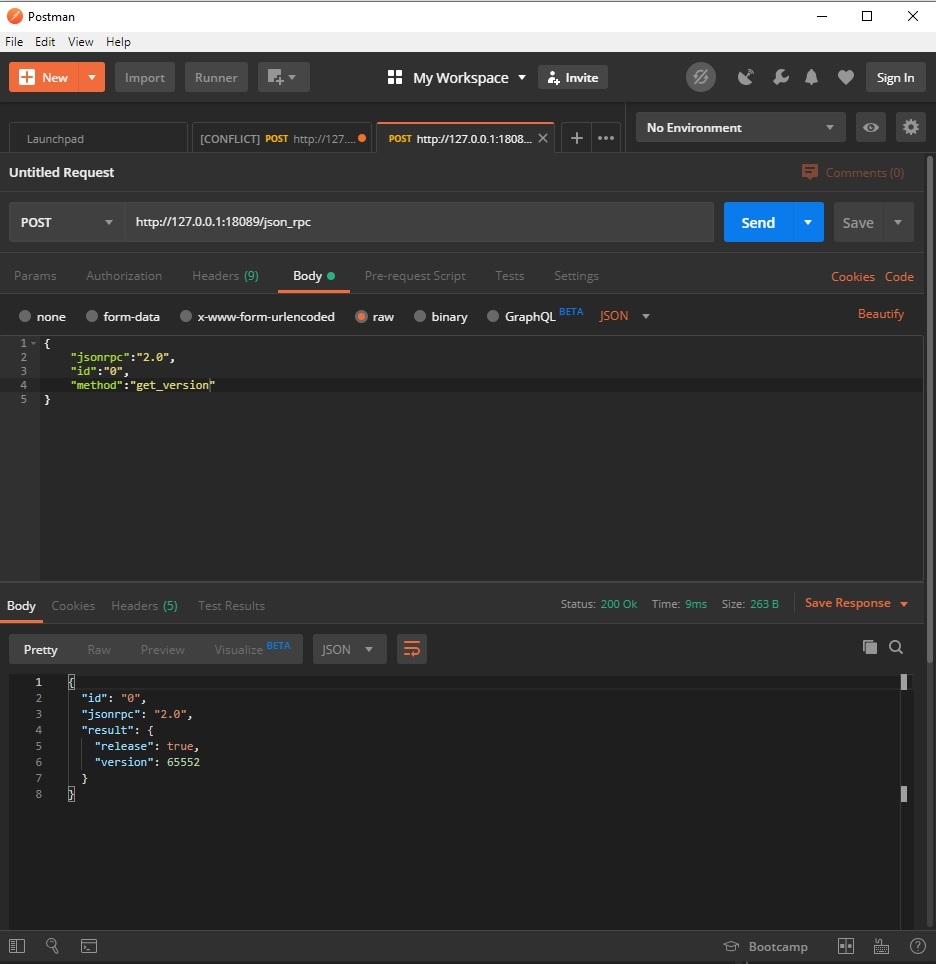

# Tutorial Monero 
## monerod walletrpc and Postman

Hi welcome in this tutorial.
We go to launch the daemon monero and manage a wallet with the rpc 

### Download the Monero's binaries

<a href="https://web.getmonero.org/downloads/" target="_blank">On the official website!</a>

Unzip the folder and you should have this structure:

<pre>
<ul>
<li>monero-blockchain-ancestry.exe</li>
<li>monero-blockchain-depth.exe</li>
<li>monero-blockchain-export.exe</li>
<li>monero-blockchain-import.exe</li>
<li>monero-blockchain-mark-spent-outputs.exe</li>
<li>monero-blockchain-prune.exe</li>
<li>monero-blockchain-prune-known-spent-data.exe</li>
<li>monero-blockchain-stats.exe</li>
<li>monero-blockchain-usage.exe</li>
<li>monerod.exe</li>
<li>monero-gen-ssl-cert</li>
<li>monero-gui-wallet-guide.pdf</li>
<li>monero-wallet-cli.exe</li>
<li>monero-wallet-gui.exe</li>
<li>monero-wallet-rpc.exe</li>
<li>opengl32sw.dll</li>
<li>start-low-graphics-mode.bat</li>
</ul>
</pre>

In this tutorial we use only ```monerod.exe``` and ```monero-wallet-rpc.exe```

### Create your wallet

You have two options to create your wallet:

* Use the GUI (just click on ```monero-wallet-gui.exe``` and follow the instructions).
* Run ```monero-wallet-cli.exe``` in your terminal and follow the instructions.

Don't forget: your wallet's password is important and your 25 words are very very important. Write them on a paper ! If you lose your 25 words you can't restore your wallet !!!

### Run the daemon

<blockquote cite="https://web.getmonero.org/resources/user-guides/vps_run_node.html">
	monerod is the daemon software that ships with the Monero tree. It is a console program, and manages the blockchain. While a bitcoin wallet manages both an account and the blockchain, Monero separates these: monerod handles the blockchain, and monero-wallet-cli handles the account.
</blockquote>

<a href="https://web.getmonero.org/resources/user-guides/vps_run_node.html">Source</a>

<br>
Go to the path:

<code>cd /path/to/monero/binaries</code>

Then launch the daemon:

<code>
./monerod.exe
</code>

### Run the RPC
Open a new terminal go the the binaries's path and run:

<code>
./monero-wallet-rpc.exe --rpc-bind-ip 127.0.0.1 --rpc-bind-port 18089 --disable-rpc-login --log-level 2 --wallet-file *your-wallet-file* --prompt-for-password
</code>

### Start Postman
In Postman, you can set body in the section form-data, but it's better to write a raw json like this:

<code>
{
	"jsonrpc":"2.0",
	"id":"0",
	"method":"get_version"
}
</code>

___



___

### Conclusion

We just set an environment to use the daemon and the RPC. For more information, read the <a href="https://web.getmonero.org/resources/developer-guides/wallet-rpc.html#get_version" target="_blank">the official documentation</a> 

